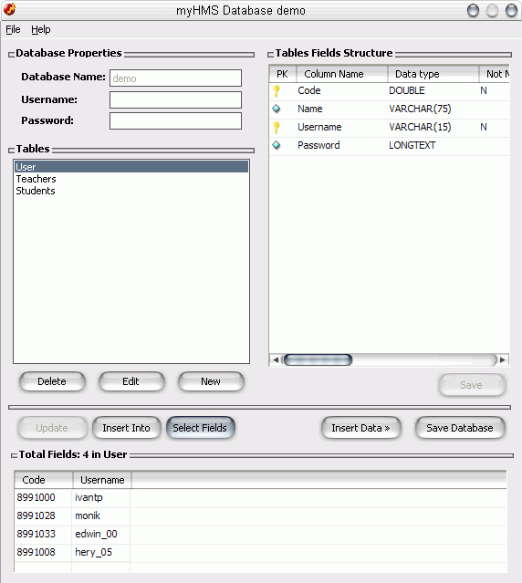



## myHMS Database Engine 1\.1 \(Update 20 Mar\)

### Description

Build DataBase using Plan Text File.

Based on Jim's original code [CodeId=60559] allows to create a Database using plane files, you can create:

1. Several tables.

2. Can put create an username and password for the database.

3. Add fields in any table specifically.

4. Select certain fields in a table.

----

In development:

1. To put to carry out searches.

2. To upgrade a chart according to parameters.

3. To compress the generated files.

----

CREDITS AND THANKS

----

Build DataBase In Text File

Jim Jose [CodeId=60559]

----

Binary File Password Encryptor class!!!

Cahaltech [CodeId=36457]

----

Dedicated to

----

Ivan T.P (halo sahabatku apa kabar)

mibi (saya mencintai kamu)

sakura_tsukino (my little sister)

Gaby (my best girl friend)

Pancho funes

http://www.fileupyours.com/files/43706/StevenControl.zip
 
### More Info
 

             |
---                |---
**Submitted On**   |2007-03-19 22:38:38
**By**             |[Heriberto Mantilla Santamaria](https://github.com/Planet-Source-Code/PSCIndex/blob/master/ByAuthor/heriberto-mantilla-santamaria.md)
**Level**          |Intermediate
**User Rating**    |5.0 (25 globes from 5 users)
**Compatibility**  |VB 6\.0
**Category**       |[Complete Applications](https://github.com/Planet-Source-Code/PSCIndex/blob/master/ByCategory/complete-applications__1-27.md)
**World**          |[Visual Basic](https://github.com/Planet-Source-Code/PSCIndex/blob/master/ByWorld/visual-basic.md)
**Archive File**   |[myHMS\_Data2054903202007\.zip](https://github.com/Planet-Source-Code/heriberto-mantilla-santamaria-myhms-database-engine-1-1-update-20-mar__1-66801/archive/master.zip)

